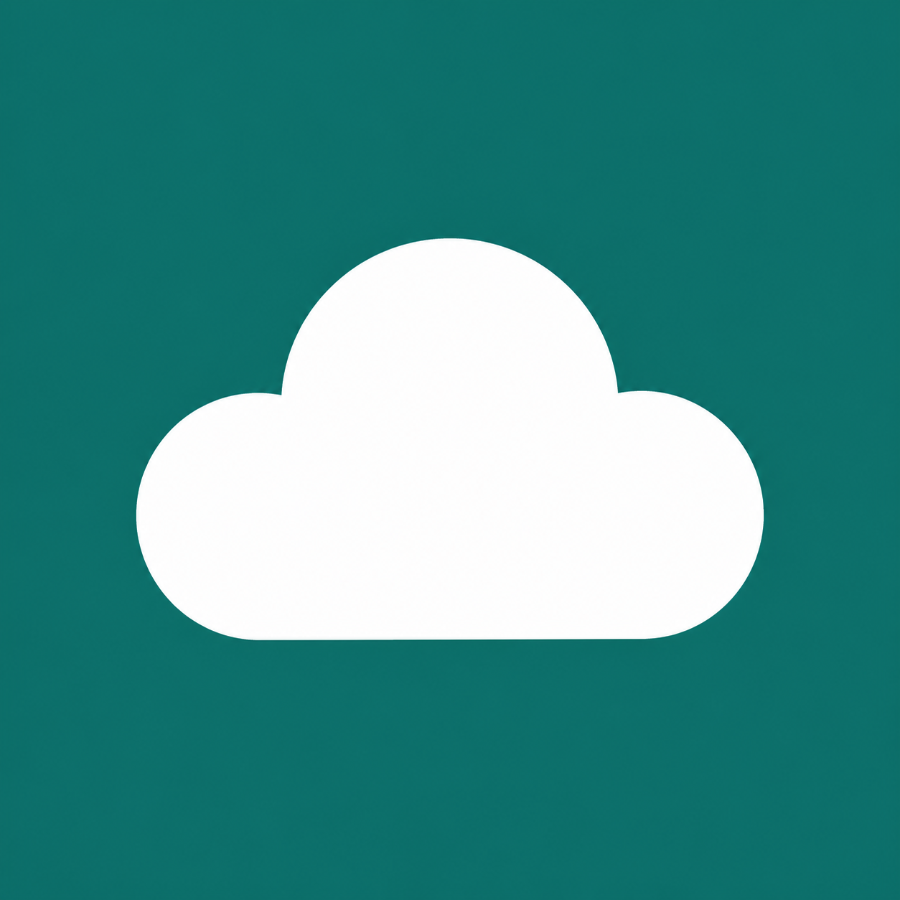

<p align="center">
  
</p>

<h1 align="center">KumoBackup</h1>

<p align="center">
  A small self-hosted backup server for Mihon/Tachiyomi-style <code>.tachibk</code> files.
</p>

<p align="center">
  <a href="#local-quick-start">Quick start</a>
  |
  <a href="#create-a-token">Tokens</a>
  |
  <a href="#api-authentication">API auth</a>
</p>

KumoBackup is a small self-hosted backup server for Mihon/Tachiyomi-style `.tachibk` backup files


## Local Quick Start

Prerequisites:

- Docker Desktop
- Docker Compose

From this folder:

```powershell
docker compose --env-file .env.example -f docker-compose.yml -f docker-compose.local.yml up --build
```

Then open:

- Admin page: <http://localhost/kumobackup/>
- Swagger: <http://localhost/kumobackup/swagger>
- Health check: <http://localhost/kumobackup/api/health>

Local Basic Auth credentials:

```text
username: admin
password: admin
```

The first build can take a little while because Docker needs to restore and publish the .NET app.

## Create A Token

1. Open <http://localhost/kumobackup/>.
2. Sign in with the local Basic Auth credentials.
3. Create a token from the token form.
4. Copy the token immediately.

Raw token values are only returned when a token is created. The admin page can copy tokens created during the current browser session, but already-existing tokens cannot be recovered. If a token is lost, revoke it and create a new one.

## Phone Access On The Same Network

If the container is running on your PC and your phone is on the same Wi-Fi, use your PC LAN IP instead of `localhost`.

Example:

```text
http://192.168.1.42/kumobackup/
```

If port 80 is blocked or already in use, change `HTTP_PORT` in `.env.example` or a copied local `.env` file, then access the server with that port:

```text
http://192.168.1.42:8080/kumobackup/
```

You may also need to allow the selected port through Windows Firewall.

## Configuration

Local defaults live in `.env.example`.

For real deployments, do not reuse the local Basic Auth credentials or the example PostgreSQL password.

## API Authentication

Backup API endpoints use bearer tokens:

```text
Authorization: Bearer <token>
```

Admin token management endpoints are intentionally exposed without app-level authentication because the expected deployment path is through Nginx Basic Auth at `/kumobackup`. Keep the app container private and route external traffic through Nginx.
